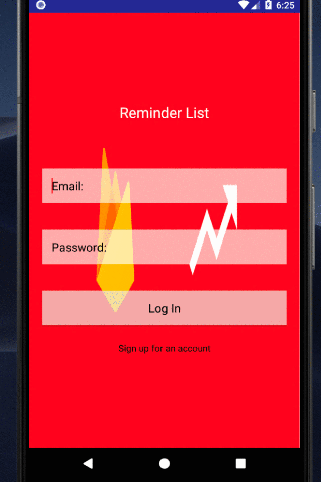
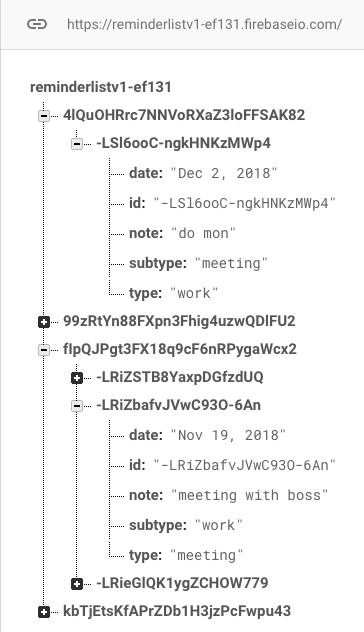

# FireList

Welcome to my version of a Reminder List, based on Reminders (iphone) and Sticky Notes (Windows 10). It essentially started as a basic exercise in learning app making for the android market. While I had various pitfalls in making this app, the most egregious being the rebuild time on a dual core laptop :), it was fun doodling things out and then trying to make it happen with code. Enjoy the app, labeled my methods as best as I could.

    
    

