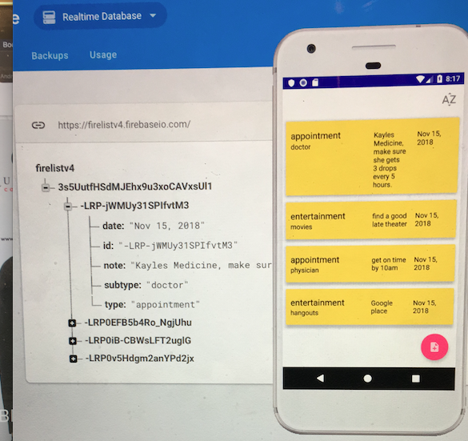
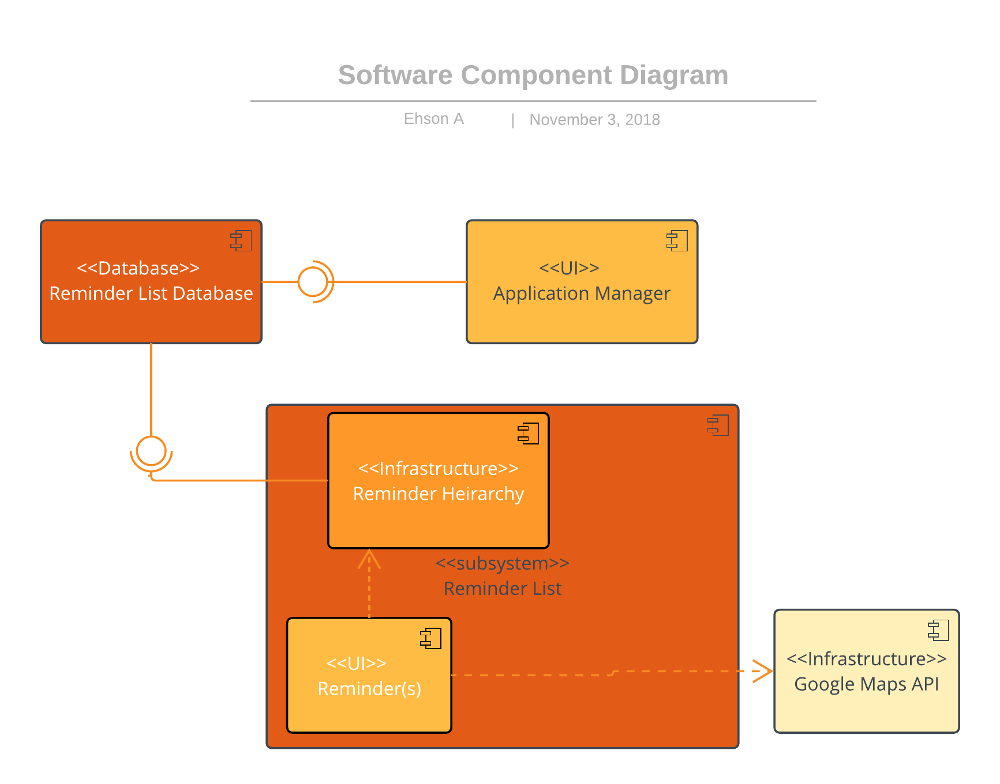
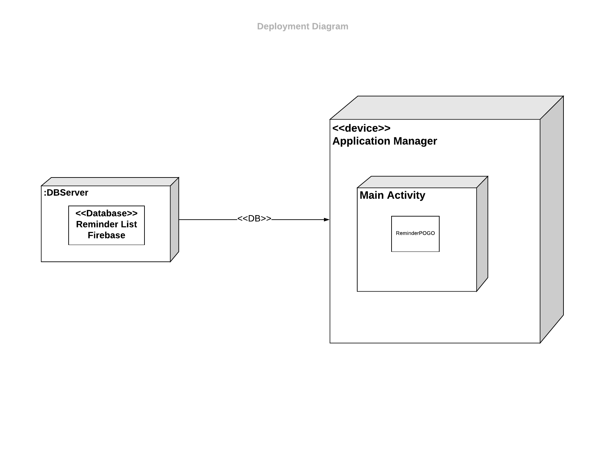
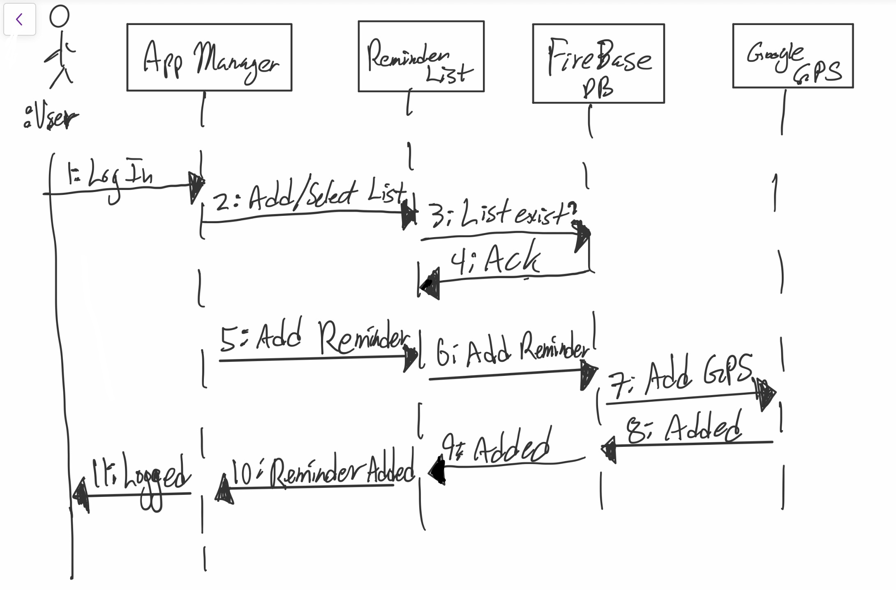
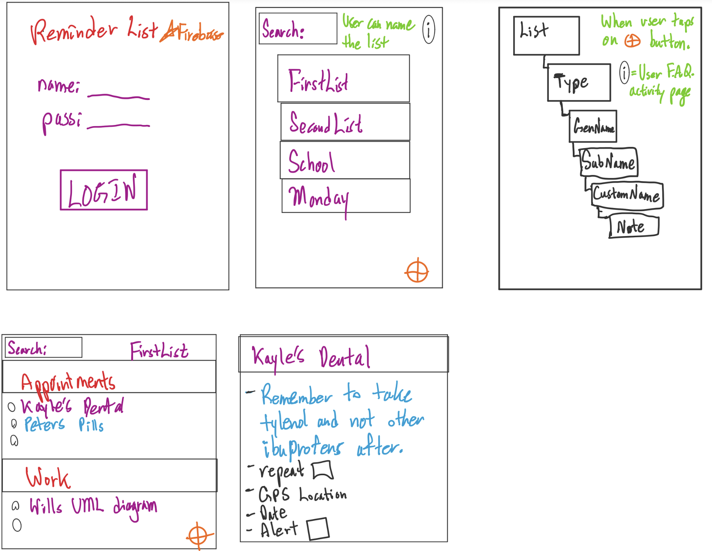

# FireList

Welcome to my version of a Reminder List, based on Reminders (iphone) and Sticky Notes (Windows 10). It essentially started as a basic exercise in learning app making for the android market. While I had various pitfalls in making this app, the most egregious being the rebuild time on a dual core laptop :), it was fun doodling things out and then trying to make it happen with code. Enjoy the app, labeled my methods as best as I could.

    
    

# Design Document

**Author**: ehson assani

## 1 Design Considerations

### 1.1 Assumptions

Significant software issues arised when implementing firebase realtime database.  Deleting an element in the array also deletes the remaining elements in the array (this is a design issue with firebase itself). Had to change from using Android studio to IntelliJ as getting error message failing to connect to firebase servers (failed to resolve firebase.0.xx.0).  Design constraints using the Layout view is itself a challenge to find what works when displaying multiple buttons.

### 1.2 Constraints

Requirements specified certain features ("heirarchy" for reminders) and how it should be structured.  In using Firebase, a noSQL non-heirarchal structured database, had to manage all with just a dictionary(key and value pairs).

### 1.3 System Environment

Android capable smartphones are well suited to handle an app such as this (reminder list). Targeting devices that support API level 15 and above.

## 2 Architectural Design

The architectual design consists of the component design and the deployment diagram. each diagram is designed and explained below as the following.

### 2.1 Component Diagram

    

As a start, there will be a total of four classes, from my previous, yet minor experience with android development.  The Application Manager will require the database interface (database = lolipop/provide and socket/require = App Manager) and so too will the Reminder List.  Having experimented with firebase, there is a high chance that only one class will be used to represent the Reminder List, Reminder Hierarchy, and Reminder(s), therefore ended up with a subsystem class.  Finally, Reminder will use Google Maps API.  

### 2.2 Deployment Diagram

    

In regards to server and client components, the database (firebase) will be server-side, so will the use of Google maps API.  Client-side as shown, will contain the App Manager, List, Heirarchy, and Reminder (on the device). 

## 3 Low-Level Design

THe following subsections portray an in depth and updated UML class diagram of the reminder list application.

### 3.1 Class Diagram

    

### 3.2 Other Diagrams

    

In a sequence behavioral diagrams, the user create(s) a list object which then goes through C.R.U.D. standard database and sends back an acknowledgement.  Then the user can create reminder(s) which passes through the db, which then the reminder has been added to the list.  Note that this is a very simplified diagram showing the basics of what is actually occurring.

## 4 User Interface Design

    

